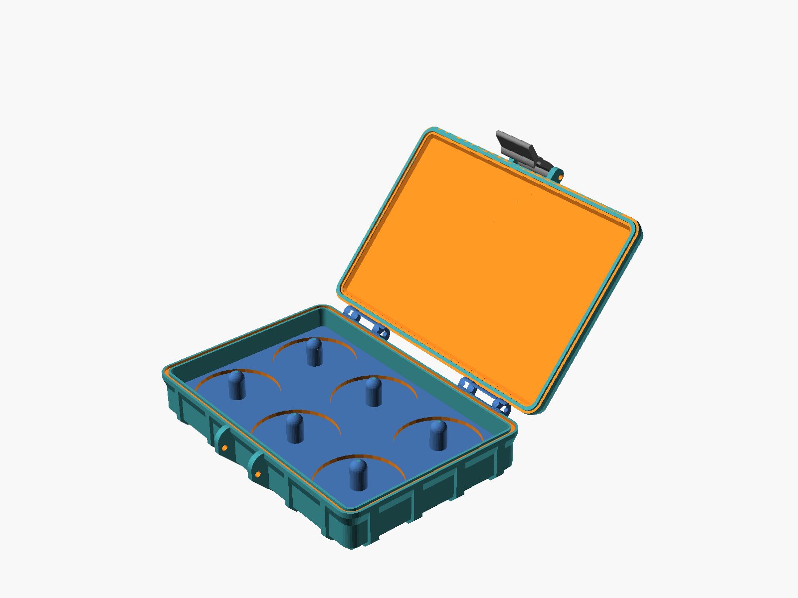

<div align="center">

# ❄️ Frost Giants Sparx Box

**A rugged, printable, hinged box for organizing [Sparx](https://sparxhockey.com) skate-sharpening grinding rings.**



</div>

## Features

- Holds **6 rings** (2 × 3) on individual posts, each with its own pocket
- Rugged hinged lid with a screw-pin hinge and a latch
- Fully parametric – change ring size, spacing, or layout and re-render
- Prints without supports, in three parts

Based on the wonderful [Universal Parametric Rugged Box](https://www.printables.com/model/648172-universal-parametric-rugged-box) by Rainer Backes.

## Print it

Grab the STLs from [`output/`](output):

| Part | File | Qty |
| --- | --- | --- |
| Lid | [`top.stl`](output/top.stl) | 1 |
| Base | [`bottom.stl`](output/bottom.stl) | 1 |
| Latch | [`latch.stl`](output/latch.stl) | 1 |

[`complete.stl`](output/complete.stl) is the assembled box, for reference only.

You'll also need **M3 × 30 mm screws** for the hinge pins and latch – 3 with the default settings (see `ScrewLength`, `ScrewDiameter`, `NumHinge` and `NumLatch` in the SCAD file).

### Embedded lid text (Orca / Bambu)

Want text on the lid? [`output/customized/top.3mf`](output/customized/top.3mf) is an Orca/Bambu Studio project showing how I embedded it. Open it, edit the text, and slice.

## Customize

1. Install [OpenSCAD](https://openscad.org) (a version with the Manifold backend and `textmetrics` support).
2. Open [`defaultbox.scad`](defaultbox.scad).
3. Tweak the variables at the top, such as `d` (ring diameter), `disk_gap`, `disks_x` and `disks_y`.
4. Use the **View** setting to pick what you see: `Complete`, `Complete Open`, `Parts`, `Lid`, `Bottom`, `Latch`, or `Seal`.

The ring-holder logic lives in `module diskHolder()` – it's everything inside the bottom of the box. The box itself comes from [`rugbox.scad`](rugbox.scad), with [BOSL2](BOSL2) bundled.

## Build

```sh
bin/build.sh
```

This regenerates every STL in `output/` and the preview image at `docs/rendering.png`. Requires `openscad` on your `PATH`. It's also available as the **Build** task in VS Code.

## Repo layout

```
defaultbox.scad     the model (edit this)
rugbox.scad         the underlying rugged-box generator
bin/build.sh        builds output/ and docs/rendering.png
output/             printable STLs
output/customized/  slicer projects (e.g. lid with embedded text)
docs/               images for this README
```
